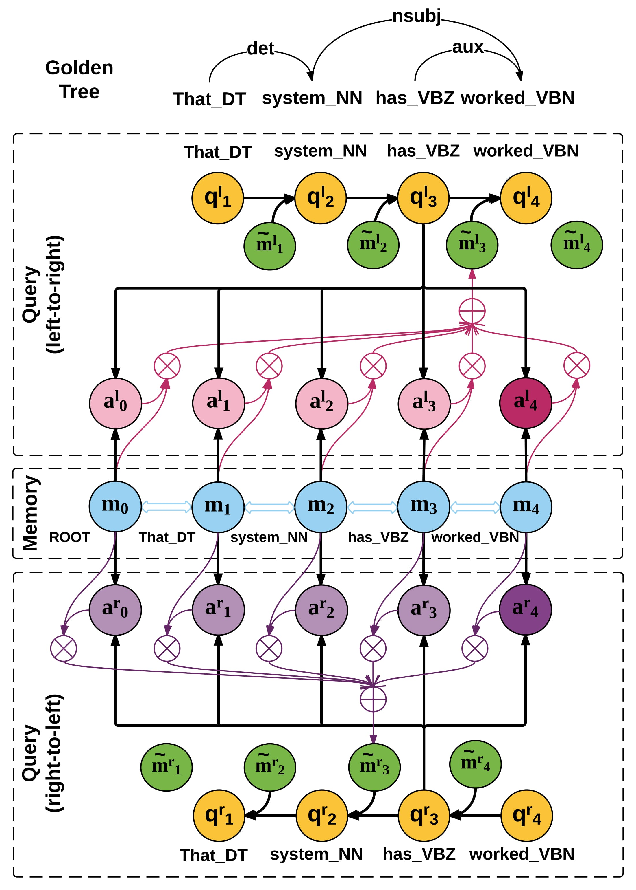

Bi-directional Attention with Agreement for Dependency Parsing
=================

This repository includes the softwares and models for the paper
[Bi-directional Attention with Agreement for Dependency Parsing](https://arxiv.org/abs/1608.02076).
```
@InProceedings{Cheng2016EMNLP,
  author    = {Hao Cheng and Hao Fang and Xiaodong He and Jianfeng Gao and Li Deng},
	title     = {Bi-directional Attention with Agreement for Dependency Parsing},
	booktitle = {Proc. Empirical Methods in Natural Language Processing (EMNLP)},
	year      = {2016}
}
```



## Requirements
- [Intel MKL](https://software.intel.com/en-us/intel-mkl) or [OpenBLAS](http://www.openblas.net/)
- [Linux] [gcc-4.8.3](https://gcc.gnu.org/gcc-4.8/) or higher
- [Windows] Microsoft Visual Studio 2013 or higher

## Compile
##### Before compiling the codes, make sure:
1. boost_1_55_0.tgz has been extracted to boost_1_55_0, unless you have BOOST_1_55_0 installed elsewhere and configured properly.
2. The BOOST program options library has been compiled.
	* We have put a few pre-compiled binaries under libs/.
3. Intel MKL has been installed.

#####To Compile the codes (Linux):
0. Ensure Intel MKL has been installed, and ```$(MKLROOT)``` has be defined using ```compilervars.sh```.
1. Edit make/memnet.mkl.mk
  * change (Line 9) ```CXX```
2. ```cd make && make```
3. The compiled binaries can be found in ```bin/```.
  * ```run_?memnet_dparser.mkl```: this binary is used to parse a conllx file with a trained model.
  * ```train_?memnet_dparser.mkl```: this binary is used to train a parser. 

- If you don't have Intel MKL, the software can also be linked to OpenBLAS libraries.
	In this case, you need to change the make/memnet.mkl.mk.
	An example Makefile for OpenBLAS is included: make/memnet.openblas.mk.

#####To Compile the codes (Windows):
1. Open the solution file msvc/MemNetDependencyParser.sln using Visual Studio;
2. Confiuration Manager: make sure you active solution configuration is Release.
3. Right click the project CMemNetTrainer and check the following three places:
	* Intel Performance Libraries -> Intel Math Kernel Library -> Use Intel MKL: choose either Parallel or Sequential.
	* C/C++ -> General -> Additional Include Directories: make sure all those folders are accessible.
		You may want to untar the boost_1_55_0.tgz if you don't have one, or
		replace the path of boost_1_55_0 if you already have BOOST installed.
	* Linker -> General -> Additional Library Directories.
	  The path is currently pointing to the pre-compiled binaries. 
		If you have your BOOST program options library ready, replace them.
4. Compile. The compiled binaries can be found in ```msvc/Release``` or ```msvc/x64/Release```, depending on the solution platform you specified.

Note we include project properties through Property Manager, and using one of
the four .props files for corresponding solution configuration.

## Usage
When you run the binaries, make sure the BOOST program options libs folder is added to PATH / LD_LIBRARY_PATH.
Use -h to check the available options.

#### Train
To train the model, please refer to the example config file under examples/configs.
./bin/train_cmement_dparser.mkl -c configs/train.config --outbase var/example

You can also provide command line parameters. Note that command line parameters overwrite config file parameters.

#### Evaluate
./bin/run_cmemnet_dparser.mkl --inmodel var/example.model --infile data/test.conllx --outfile var/example.out

Post-processing ...
In order to enable mini-batch training, we group sentences according to their length.
Therefore, internally, the order of the training instances are not preserved.
This is not an issue for training, but it affects evaluation of the parsing output.
In order to align the reference and parsed output, we require the reference file is ordered by sentence length, use that file as the input to the run_cmemnet_dparser.mkl.
You can run xxx 

## Known issues:
- The tialnn-0.0.1 library is still under development and some un-used
	interfaces are not fully supported. 
	We will actively update the software.
	In this version (0.0.1), we aim at making the results reported in the paper
	reproducible.

## Question Contact
- Hao Cheng 
- Hao Fang 
